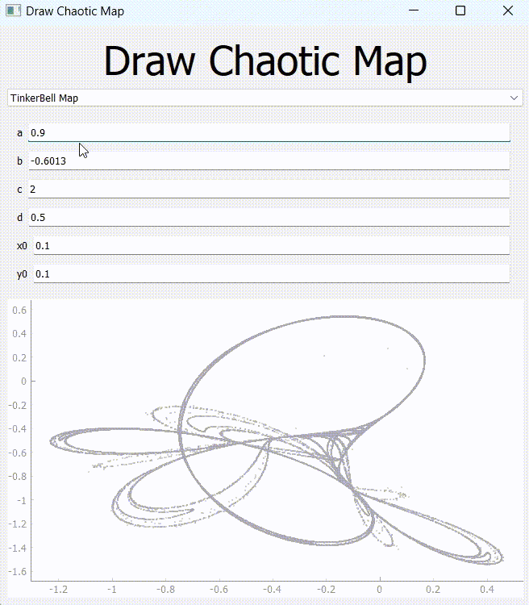

# draw-chaotic-map
This repository allows you to simulate and visually analyze chaotic maps through an intuitive graphical user interface (GUI). With this interactive tool, you can gain insights into various chaotic systems in real-time.

## Installation
`pip install -r requirements.txt`

## Usage
`py gui.py`

## Implemented Chaotic Maps
- TinkerBell Map
- Ikeda Map
- Clifford Attractor
- Bogdanov Map
- Gingerbread Map
- Standard Map
- Gumowski-Mira Attractor

## GUI Features
- Map Selection Dropdown: A dropdown list containing the names of default chaotic maps. When a map is selected from the dropdown, the GUI will update and display the trajectory of the chosen map.
- Parameter Input Fields: The main text boxes in the GUI allow you to specify the values of the parameters for the selected chaotic map. The parameters include a, b, c, d, x0, and y0. After entering the desired values, click outside the text box or press Enter to apply the changes and update the map.
- Multi-Point Simulation Parameters: For maps that require multi-point simulation, additional input fields will be displayed. These include xmin, xmax, ymin, ymax, and step_size. The multi-point simulation allows you to explore the behavior of the map for different starting points within the specified range.
- Graph Space: The graph space displays the trajectory of the selected chaotic map based on the provided parameters. The simulation runs automatically when the GUI is launched or when you change the map or parameter values.
- Zoom and Navigation: You can use the mouse wheel to zoom in and out of the graph space. Additionally, you can pan by clicking and dragging the graph area.

## Examples

